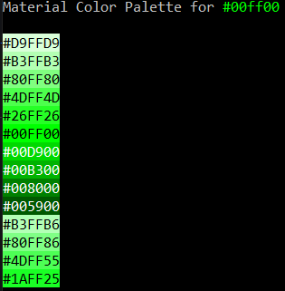
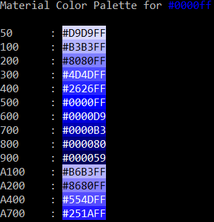
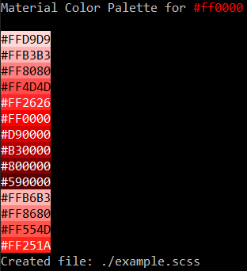

# material-palette-generator (mpg)

Node.js cli utility to generate material color palettes. Following the material guidelines at [material.io](https://material.io/design/color/the-color-system.html#)

## Installing
with npm:
`npm install material-palette-generator`

## Options
    mpg

| Short        |  Full          | Description  |
| :- | :- | :- |
| -V      | --version | Output the version number |
| -c      | --color      |   Base color of the palette in hexadecimal format |
| -p | --print     |  Output palette and names to console |
| -f | --format     |  Set the outputformat (see [config](https://github.com/KaindlJulian/material-palette-generator/blob/master/config/config.json)) |
| -d | --directory     |  Path where the file will be created |
| -n | --file-name     |  Name of the created file (standard is material-palette.scss) |
| -h | --help     |  Output usage information |

## Examples

#### Standart Output
`mpg -c #00ff00` 

#### Output with names
`mpg -c #0000ff --print` 

#### Output to file
`mpg -c #ff0000 --format material2 -d ./ --file-name example.scss` 

[example.scss](https://github.com/KaindlJulian/material-palette-generator/blob/master/examples/example.scss)
